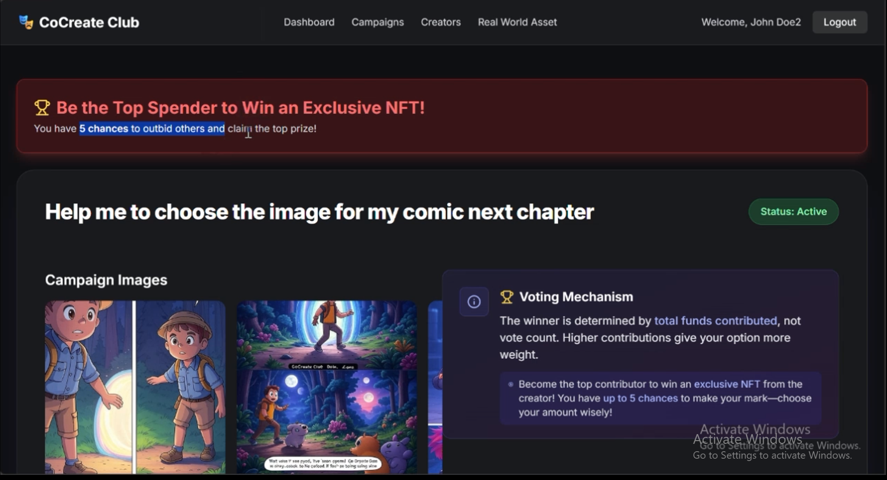
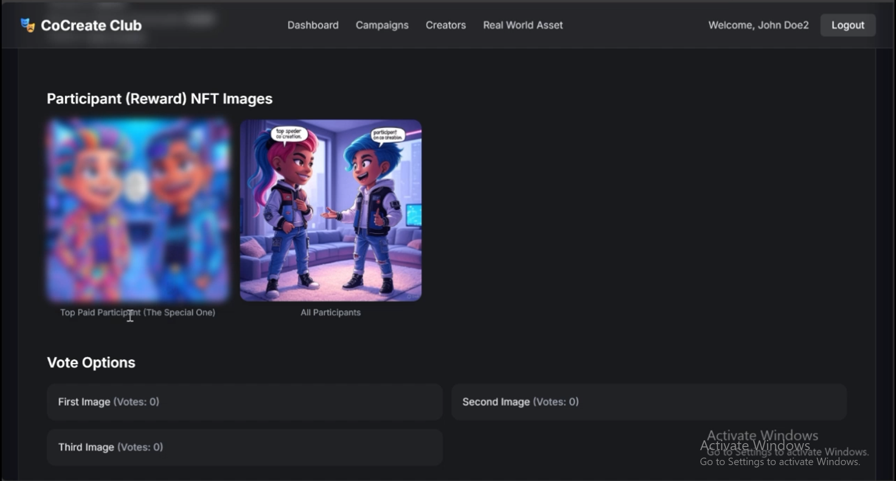
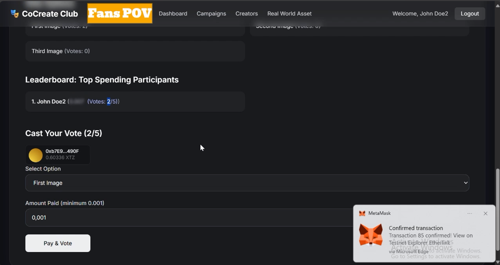
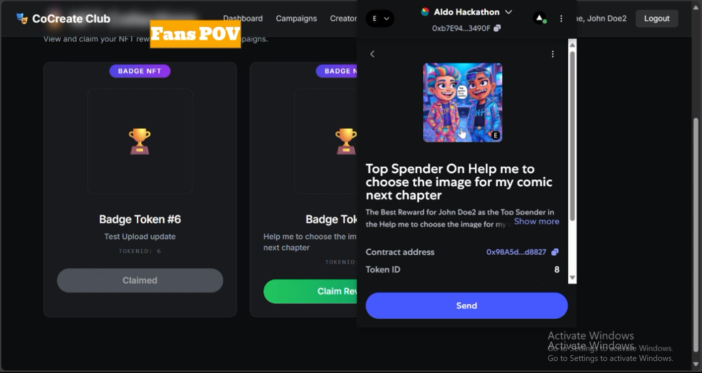
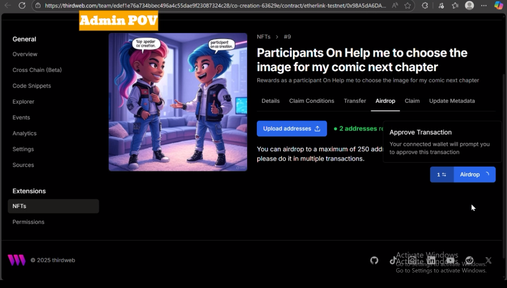
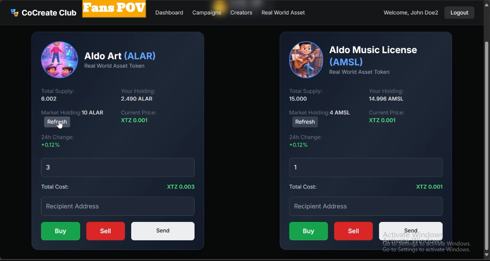

# CoCreate Club

**CoCreate Club** is a **gamified voting platform** on the **Etherlink Testnet (Ghostnet)** where votes carry weight based on **XTZ contributions**. The **option with the highest total XTZ wins**, not the most votes.  

On this platform, **you can:**  
- **Co-create content** by voting **(to help creators deciding the content direction)**
- **Compete to be the top spender** in a campaign to **win an exclusive NFT from the creator**  
- **Support creators** through **real-world asset ownership**



Voters / Audiences get **five chances to contribute** at least a **minimum XTZ amount**, with **higher contributions boosting leaderboard rankings**.  

All participants in a campaing also receive the NFT reward.

**Themed campaigns** like **The Battle of Meme Kings** make community participation **engaging, rewarding, and viral**.

---

## Demo Video

Watch the demo video below:

[![Demo Video]](https://www.youtube.com/watch?v=SnIgB-3fTJI)


## Features

- **Gamified Voting & Collaborative Content Creation**:  
  - Every **vote influences content direction** and **supports creators**  
  - **Total XTZ spent determines the winning option**, not the number of votes  
  - *(e.g., 1 vote of 0.009 XTZ beats 5 votes totaling 0.005 XTZ)* 



- **Live Leaderboard Spender**:  
  - Every participants will be listed here  
  - **Pay more** to climb your rank to **win the exlusive NFT reward**
  - **If campaign status is active** everyone will see the other particpants **total amount is blurry**, till its finish they can see it **(this means to make the experience to win the exclusive NFT as top spender become more exciting and fun)**



- **Exclusive NFT Rewards ERC-1155**:
  - **Top spender** in each campaign wins an **exclusive NFT**  



- **All Participants NFT Rewards ERC-1155 NFTs**:
  - **All participants** receive a **reward NFT** (airdrop for general participants, claim for top spender)



- **RWA Marketplace**:  
  - **Tokenized real-world assets (RWA)** as **ERC-20**  
  - Enables **fractional ownership** and **liquidity trading** for assets like **art or music royalties**  



- **Etherlink Integration**:  
  - Built on **Etherlink Testnet (Ghostnet)** for **fast, low-cost transactions**  

- **Thirdweb Integration**:  
  - Manages **wallet connectivity, NFT minting/claiming, and RWA tokenization**  
  - Supports **ERC-1155** for campaign NFTs and **ERC-20** for RWA liquidity

## Tech Stack

- **Frontend:** Next.js, React, TypeScript, Tailwind CSS  
- **Blockchain:** Etherlink Testnet (Ghostnet), XTZ as native currency  
- **Thirdweb:** Wallet integration, contract interactions, ERC-1155 NFT operations  
- **Backend:** Node.js, MongoDB, Swagger *(for campaign management and NFT reward storage)*  
- **Dependencies:** Axios, react-hot-toast, lucide-react  

---

## How It Uses Etherlink

- **Voting Transactions**:  
  Users **pay XTZ to vote**, sending transactions to a **campaign treasury address** using  
  `prepareTransaction` and `toWei` from **Thirdweb**.

- **NFT Minting & Trading**:  
  **Top spender and participant NFTs** are minted **on-chain** with **low fees**.


- **RWA Marketplace**  
  - **Asset shares tokenized as NFTs** for co-ownership  
  - **ERC-20 tokens for RWAs** provide **fractional ownership** and **better liquidity**  
  - **Buy/sell/transfer functions** executed via **smart contracts**

**Configuration File:** `/lib/etherlinkChain.ts`

```ts
Chain ID: 128123
RPC: https://node.ghostnet.etherlink.com
Explorer: https://testnet.explorer.etherlink.com
```

## How It Uses Thirdweb

Thirdweb powers all blockchain interactions for **voting**, **NFT rewards**, and **RWA tokenization**.

### **Wallet Connectivity**
- `ConnectButton` & `useActiveAccount` → Enable seamless **user authentication** and **transaction signing**

### **Contract Interactions**
- `getContract` & `readContract` → Fetch **metadata** (name, symbol, supply, balances)
- `sendTransaction` → Handle **voting transactions**, **NFT minting**, **ERC-20 transfers**, and **claim conditions**

### **ERC-1155 NFT Operations** *(Campaign Rewards)*
- `lazyMint` → Mint **NFT badges** for campaigns (exclusive for top spenders or for all participants)  
- `claimTo` → Allow **participants to claim their earned campaign NFTs**  
- `getNFT` & `getOwnedTokenIds` → Retrieve **NFT metadata** & **ownership details**

### **ERC-20 Token Operations** *(RWA Tokenization & Liquidity)*
- Used to **tokenize real-world assets (RWA)** for **fractional ownership**  
- Enables **buying, selling, and trading** RWA tokens with **better liquidity** on-chain  
- Integrated with Thirdweb for **transfer, approval, and marketplace operations**

### **TransactionButton**
- Simplifies **voting**, **RWA ERC-20 trading**, and **NFT claiming** with **pre-configured logic**

## Usage

### **Creators**
- Create campaigns via  
  `/components/creators/menus/Campaign.tsx`
- Set **vote options**, **minimum price**, and **upload NFT reward images**

### **Voters / Audiences**
- Vote up to **5 times per campaign** at  
  `/campaigns/[id]/page.tsx`
- Pay **XTZ** to **influence outcomes** and **climb the leaderboard**

### **Admins**
- Deploy **NFT badges for top spenders** at  
  `/components/admin/menus/DeployNFTasBadge.tsx`
- Manage **reward distribution**

### **RWA Marketplace**
- Buy, sell, or trade **asset shares as NFTs** at  
  `/app/rwa/page.tsx`

### **NFT Collections**
- **Top spender** can **claim their exclusive NFT** via  
  `/components/audience/menus/NFTCollections.tsx`
- **All participants** will **receive reward NFTs via airdrop** handled through the **Thirdweb dashboard**

### **Blockchain Config**
- Update or view **Etherlink chain settings** at `/lib/etherlinkChain.ts`

## Contract Addresses (Testnet)

The following **testnet contract addresses** are used in this project and can be checked on the Etherlink Testnet Explorer:

- **Main Campaign Contract / Exclusive NFT & All Participants NFT rewards:**  
  [`0x98A5dA6DA640426A30eD85d7e4B101872F5d8827`](https://testnet.explorer.etherlink.com/address/0x98A5dA6DA640426A30eD85d7e4B101872F5d8827)

- **Campaign Receiver (Treasury):**  
  [`0xb7E9430eF91a97C54b988a27750Fdbb29173490F`](https://testnet.explorer.etherlink.com/address/0xb7E9430eF91a97C54b988a27750Fdbb29173490F)

- **RWA Aldo Art:**  
  [`0xa594d58761EE8Dda20f91F66Bc769c22d07A8f0b`](https://testnet.explorer.etherlink.com/address/0xa594d58761EE8Dda20f91F66Bc769c22d07A8f0b)

- **RWA AMSL:**  
  [`0xA7b200e05A48892a26797946350d12cCb7b08133`](https://testnet.explorer.etherlink.com/address/0xA7b200e05A48892a26797946350d12cCb7b08133)

- **RWA Marketplace:**  
  [`0x9108DDA1b1a5C1594fdade40862Fd84745542e5D`](https://testnet.explorer.etherlink.com/address/0x9108DDA1b1a5C1594fdade40862Fd84745542e5D)


## License

MIT
